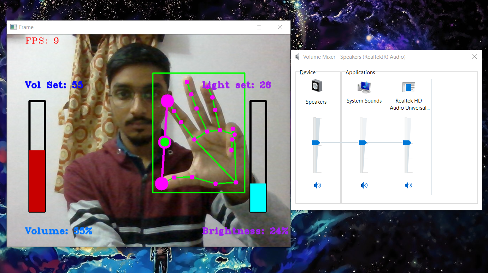
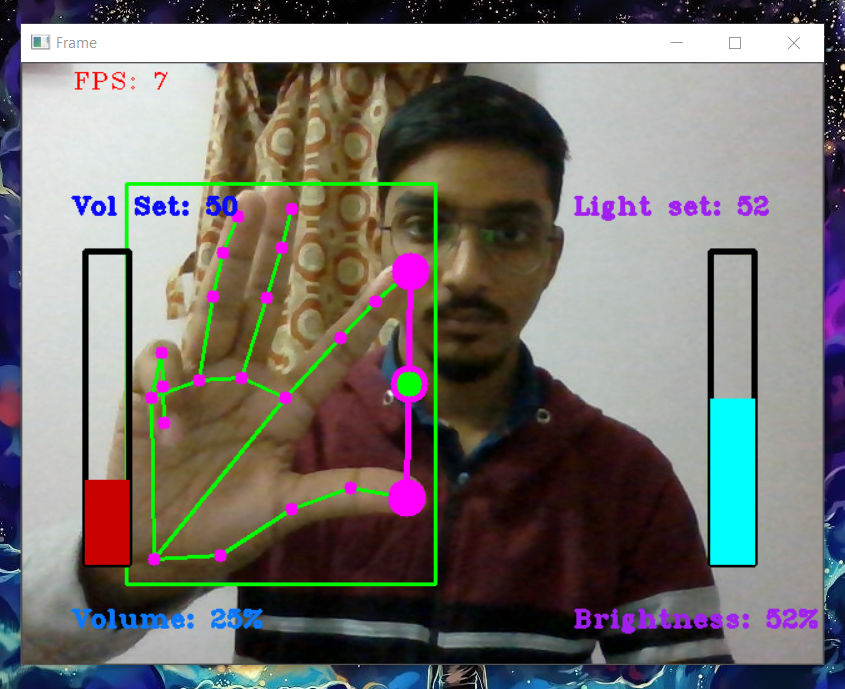

# GCVB: Gesture Control for Volume and Brightness in PC or Laptop
***
## Demo Link
https://www.linkedin.com/posts/aniruddha-jana-aj_connections-computervision-project-activity-6881648285652664320-ocOz
## <u>Dependencies and Installation</u>

- Python >= 3.7 (Recommend to use [Anaconda](https://www.anaconda.com/download/#linux))

- Optional: NVIDIA GPU + [CUDA](https://developer.nvidia.com/cuda-downloads)


### Installation

1. Clone repo

    ```bash
    git clone https://github.com/AniruddhA-Omni/gesture_control.git
    cd GestureControl
    ```
2. Install dependent packages
    ```bash
    pip install -r requirements.txt
   ```

### Run the program
   ```
   python main.py
   ```

## <u>Instructions</u>
- Keep the hands <i>20cm - 30cm</i> away from Camera and use <i>one hand</i> at a time
- Use <b>Right</b> hand to control <b>Volume</b>
<p align="center">
  
</p>
- Use <b>Left</b> hand to control <b>Brightness</b>
<p align="center">
  
</p>
- While there is a line between your thumb and first finger, to select the desired value, <b>move 
down</b> your <i>little/pinky finger</i>
<br>
- Press ESC to quit from the program
